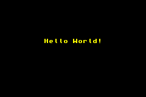
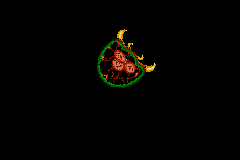

# ZigGBA

ZigGBA is an SDK for creating Game Boy Advance games using the [Zig](https://ziglang.org/) programming language. It is currently in a WIP/experimental state. This repository is a maintained fork of [wendigojaeger/ZigGBA](https://github.com/wendigojaeger/ZigGBA).

Many thanks to [TONC](https://gbadev.net/tonc/) and [GBATEK](https://problemkaputt.de/gbatek.htm), both of which have been major inspirations and resources for this project.

Add to your `build.zig.zon`:

    zig fetch --save git+https://github.com/braheezy/ZigGBA.git

If you want to use the build helper for converting assets (most users do), add `zigimg`:

    zig fetch --save git+https://github.com/zigimg/zigimg.git

In your `build.zig`:

```zig
const std = @import("std");
// Import ziggba to get access to build helpers
const ziggba = @import("ziggba");

pub fn build(b: *std.Build) void {
    // Get the GBA module
    const ziggba_dep = b.dependency("ziggba", .{});
    const gba_mod = ziggba_dep.module("gba");

    // Using a build helper, build a GBA ROM from your source
    _ = ziggba.addGBAExecutable(b, gba_mod, "tonc_tutor", "src/main.zig");

    const mode4flip = ziggba.addGBAExecutable(b, gba_mod, "mode4flip", "mode4flip.zig");
    // Convert bitmaps and create a palette. This requires `zigimg` in your `build.zig.zon`
    ziggba.convertMode4Images(mode4flip, &[_]ziggba.ImageSourceTarget{
        .{
            .source = "front.bmp",
            .target = "front.agi",
        },
        .{
            .source = "back.bmp",
            .target = "back.agi",
        },
    }, "mode4flip.agp");
}

```

## Fork

I'm learning GBA development from [Tonc](https://gbadev.net/tonc) and it's so well documented that it's fairly straightforward to add library support for missing features. Development in this fork happens at much greater rate than can be merged upstream. I've made large opinionated changes to things like that build system and I haven't figured out how to cleanly merge upstream.

### Features

It's mostly new demos from Tonc, but sometimes it requires extensive library edits to support:

- `hello`: Basic screen entry text rendering. The `sys` and `verdana` fonts from Tonc are supported. There's basic layout format parsing support.

  

- Updated build system that doesn't use git submodules, as seen above.

- L277 compression when creating image assets, decoded using GBA bios routines.

```bash
# Images are much smaller
# Before
ls -l examples/mode4flip/*agi
38k examples/mode4flip/back.agi
38k examples/mode4flip/front.agi
# After
ls -l examples/mode4fliplz/*lz
6.3k examples/mode4fliplz/back.lz
6.3k examples/mode4fliplz/front.lz
# Making the rom smaller
ls -l zig-out/bin/mode4flip*
78k zig-out/bin/mode4flip.gba
14k zig-out/bin/mode4fliplz.gba
```

- Basic interrupt routine behavior and ASM master isr table.

  

- BIOS and software interrupt (`swi`) improvements. This shows bitmap text render support

  

- Sound demo, with lots of screen entry text rendering:

https://github.com/user-attachments/assets/fd172976-68c3-4222-9f3a-d6ee326c7f89

## Build

This library uses Zig 0.14.1. To install using [`zigup`](https://github.com/marler8997/zigup):

```sh
zigup 0.14.1
```

To build, simply use Zig's integrated build system

```bash
zig build
```

ZigGBA's `zig build` will write example ROMs to `zig-out/bin/`. These are files with a `*.gba` extension which can be run on a GBA using special hardware, or which can run in emulators such as [mGBA](https://github.com/mgba-emu/mgba), [Mesen](https://github.com/SourMesen/Mesen2/), [no$gba](https://problemkaputt.de/gba.htm), and [NanoBoyAdvance](https://github.com/nba-emu/NanoBoyAdvance).

## Showcase

First example running on an emulator:


First example running on real hardware:


