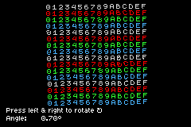
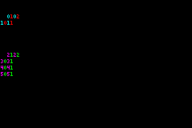

# ZigGBA

ZigGBA is an SDK for creating Game Boy Advance games using the [Zig](https://ziglang.org/) programming language. It is currently in a WIP/experimental state. This repository is a maintained fork of [wendigojaeger/ZigGBA](https://github.com/wendigojaeger/ZigGBA).

For bug reports and feature requests, please submit a [GitHub issue](https://github.com/braheezy/ziggba/issues). For general questions and support, you can submit an issue or you can visit the [gbadev Discord server](https://discord.gg/7DBJvgW9bb) which has a `#ziggba` channel for discussions specifically about this project, as well as other channels for more general discussions about GBA development.

Many thanks to [TONC](https://gbadev.net/tonc/) and [GBATEK](https://problemkaputt.de/gbatek.htm), both of which have been major inspirations and resources for this project.

## Usage

The current support Zig version is `0.16.0-dev.1262+be4eaed7c`. Get it with `zigup 0.16.0-dev.1262+be4eaed7c`.

Add to your `build.zig.zon`:

    zig fetch --save git+https://github.com/braheezy/ZigGBA.git

In your `build.zig`:

```zig
const std = @import("std");
// Import ziggba to get access to build helpers
const ziggba = @import("ziggba");

pub fn build(b: *std.Build) void {
  // Create the custom builder.
  const gba_b = ziggba.GbaBuild.create(b);

  // Make a ROM.
  _ = gba_b.addExecutable(.{
      // The output will be 'name.gba'
      .name = "first",
      // The main file to compile.
      .root_source_file = b.path("first.zig"),
  });
}
```

And a minimal ROM:

```zig
// Import the main GBA framework
const gba = @import("gba");

// Required GBA header.
export var header linksection(".gbaheader") = gba.Header.init("FIRST", "AFSE", "00", 0);

// Required exported main function.
pub export fn main() void {
    gba.display.ctrl.* = .initMode3(.{});
    const mode3 = gba.display.getMode3Surface();
    mode3.setPixel(120, 80, .rgb(31, 0, 0));
    mode3.setPixel(136, 80, .rgb(0, 31, 0));
    mode3.setPixel(120, 96, .rgb(0, 0, 31));
}
```

## Fork

This fork has too many changes to document. The highlights are:

- Integrated Zig build system instead of git submodules
- Many API rewrites and fixes
- New core features: interrupts, sound, text


## Build Details

ZigGBA's `zig build` will write example ROMs to `zig-out/`. These are files with a `*.gba` extension which can be run on a GBA using special hardware, or which can run in emulators such as [mGBA](https://github.com/mgba-emu/mgba), [Mesen](https://github.com/SourMesen/Mesen2/), [no$gba](https://problemkaputt.de/gba.htm), and [NanoBoyAdvance](https://github.com/nba-emu/NanoBoyAdvance).

Pass the `-Dgdb` flag to `zig build` to also output an `*.elf` file containing debug symbols.

See the [ziggba-example](https://www.github.com/pineapplemachine/ziggba-example) repository for an example of a project which uses ZigGBA as a dependency.

## Showcase

First example running on an emulator:


First example running on real hardware:


A whole bunch of [examples](./examples/):

<details>
  <summary>bgAffine</summary>

  
</details>

<details>
  <summary>charBlock</summary>

  
</details>
