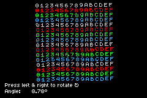
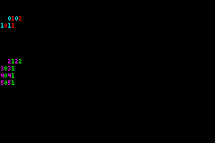

# ZigGBA

ZigGBA is an SDK for creating Game Boy Advance games using the [Zig](https://ziglang.org/) programming language. It is currently in a WIP/experimental state. This repository is a maintained fork of [wendigojaeger/ZigGBA](https://github.com/wendigojaeger/ZigGBA).

For bug reports and feature requests, please submit a [GitHub issue](https://github.com/braheezy/ziggba/issues). For general questions and support, you can submit an issue or you can visit the [gbadev Discord server](https://discord.gg/7DBJvgW9bb) which has a `#ziggba` channel for discussions specifically about this project, as well as other channels for more general discussions about GBA development.

Many thanks to [TONC](https://gbadev.net/tonc/) and [GBATEK](https://problemkaputt.de/gbatek.htm), both of which have been major inspirations and resources for this project.

## Usage

The current support Zig version is `0.16.0-dev.1262+be4eaed7c`. Get it with `zigup 0.16.0-dev.1262+be4eaed7c`.

Add to your `build.zig.zon`:

    zig fetch --save git+https://github.com/braheezy/ZigGBA.git

In your `build.zig`:

```zig
const std = @import("std");
// Import ziggba to get access to build helpers
const ziggba = @import("ziggba");

pub fn build(b: *std.Build) void {
  // Create the custom builder.
  const gba_b = ziggba.GbaBuild.create(b);

  // Make a ROM.
  _ = gba_b.addExecutable(.{
      // The output will be 'name.gba'
      .name = "first",
      // The main file to compile.
      .root_source_file = b.path("first.zig"),
  });
}
```

And a minimal ROM:

```zig
// Import the main GBA framework
const gba = @import("gba");

// Required GBA header.
export var header linksection(".gbaheader") = gba.Header.init("FIRST", "AFSE", "00", 0);

// Required exported main function.
pub export fn main() void {
    gba.display.ctrl.* = .initMode3(.{});
    const mode3 = gba.display.getMode3Surface();
    mode3.setPixel(120, 80, .rgb(31, 0, 0));
    mode3.setPixel(136, 80, .rgb(0, 31, 0));
    mode3.setPixel(120, 96, .rgb(0, 0, 31));
}
```

## Images

ZigGBA includes an experimental typed image-asset path for common formats.
It generates a module instead of requiring the game to manage generated
binary paths:

```zig
const exe = gba_b.addExecutable(.{
    .name = "game",
    .root_source_file = b.path("src/main.zig"),
});
var assets = exe.createAssetModule();
_ = assets.addImage("player", .{
    .source_file = b.path("assets/player.png"),
});
assets.addImport("assets");
```

The game can then import the asset as ordinary Zig code:

```zig
const assets = @import("assets");
const player = assets.player;

gba.display.memcpyObjectTiles4Bpp(0, player.tiles[0..]);
gba.display.memcpyObjectPalette(0, player.palette[0..]);
```

The current default target is 4bpp OBJ tiles. It reserves palette index 0
for transparent pixels, converts colors to RGB555, and reports an error when
more than 15 opaque colors are required.

Projects that need a locked palette or intentionally lossy conversion can opt
in explicitly. A sprite-sheet grid supplies frame metadata without changing
the source image's row-major tile order:

```zig
_ = assets.addImage("hero", .{
    .source_file = b.path("assets/hero.png"),
    .palette = .{ .provided = &.{ .white, .red, .blue } },
    .sprite_sheet = .{ .frame_width = 16, .frame_height = 16 },
});
// Use `.palette = .{ .nearest = ... }` only when nearest-color mapping is
// desired. Generated assets expose `frame_count`, `frames_x`, `frames_y`,
// and `frameTileIndex` for the source-order tile layout.
```

Lower-level image converters remain available for project-specific processing
and formats not yet covered by this high-level API.

### Tiled backgrounds

Use `bg_tilemap_4bpp` to generate 4bpp tiles and a normal-background map from
one PNG. The map is padded to the GBA's 32×32 or 64×64 screenblock layouts and
its entries use tile index zero as the first generated tile.

```zig
_ = assets.addImage("level", .{
    .source_file = b.path("assets/level.png"),
    .format = .bg_tilemap_4bpp,
    .tilemap = .{
        .dedupe = true,
        .dedupe_flips = true,
    },
});
```

At runtime, configure the matching map size and copy the generated data:

```zig
const level = assets.level;
const bg0_map = gba.display.BackgroundMap.setup(0, .{
    .base_screenblock = 28,
    .size = level.background_size,
});
gba.display.memcpyBackgroundPalette(0, level.palette[0..]);
gba.display.memcpyBackgroundTiles4Bpp(0, level.tiles[0..]);
bg0_map.copyFrom(level.map[0..]);
```

Source-order tiles are the default. Enable `dedupe` and `dedupe_flips` only
when smaller tile data is worth the resulting non-linear tile indices.

### Mode 4 bitmaps

`mode4_bitmap_8bpp` produces a full 240×160 indexed bitmap and a 256-color
background palette. It uses the same exact-by-default palette policy as tile
assets:

```zig
_ = assets.addImage("title", .{
    .source_file = b.path("assets/title.png"),
    .format = .mode4_bitmap_8bpp,
});
```

Load it into either Mode 4 buffer with ordinary typed data:

```zig
const title = assets.title;
gba.mem.memcpy(gba.display.getMode4Surface(0).data, title.pixels, title.pixel_count);
gba.display.memcpyBackgroundPalette(0, title.palette[0..]);
```

Frames that will be displayed with one palette should use a shared palette
collector before their image assets are created:

```zig
const palette = exe.addMode4Palette(.{
    .source_files = &.{
        b.path("assets/front.png"),
        b.path("assets/back.png"),
    },
});
_ = assets.addImage("front", .{
    .source_file = b.path("assets/front.png"),
    .format = .mode4_bitmap_8bpp,
    .palette = .{ .provided = palette.getOpaqueColors() },
});
```

## Fork

This fork has too many changes to document. The highlights are:

- Integrated Zig build system instead of git submodules
- Many API rewrites and fixes
- New core features: interrupts, sound, text


## Build Details

ZigGBA's `zig build` will write example ROMs to `zig-out/`. These are files with a `*.gba` extension which can be run on a GBA using special hardware, or which can run in emulators such as [mGBA](https://github.com/mgba-emu/mgba), [Mesen](https://github.com/SourMesen/Mesen2/), [no$gba](https://problemkaputt.de/gba.htm), and [NanoBoyAdvance](https://github.com/nba-emu/NanoBoyAdvance).

Pass the `-Dgdb` flag to `zig build` to also output an `*.elf` file containing debug symbols.

See the [ziggba-example](https://www.github.com/pineapplemachine/ziggba-example) repository for an example of a project which uses ZigGBA as a dependency.

## Showcase

First example running on an emulator:


First example running on real hardware:


A whole bunch of [examples](./examples/):

<details>
  <summary>bgAffine</summary>

  
</details>

<details>
  <summary>charBlock</summary>

  
</details>
