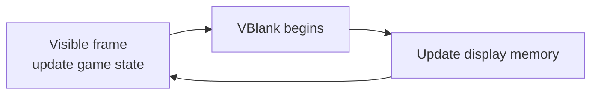

# Interrupts and timing

VBlank is the short period after the visible frame. It is the natural place to pace a game and update display memory. Begin with `display.naiveVSync`; when you need the BIOS wait call, enable VBlank in the display status register, interrupt enable register, and interrupt master control, then call `bios.vblankIntrWait`.



`interrupt.init` performs the VBlank interrupt setup needed by `vblankIntrWait`. In a simple game loop, update game state during the visible frame, wait for VBlank, then update palette, tile, map, or object data:

```zig
gba.interrupt.init();

var shade: u5 = 0;
while (true) {
    // Game state for the next frame.
    shade +%= 1;

    gba.bios.vblankIntrWait();
    gba.display.bg_palette.banks[0][0] = .rgb(shade, 0, 0);
}
```

An interrupt handler runs outside the normal flow of the game. Keep it short. Set a flag, advance a counter, acknowledge the event through the SDK path, and return. Do not render a scene, allocate memory, or wait for another interrupt from inside a handler.

Timers count clock-derived intervals and can raise interrupts on overflow. They suit music timing, measurements, and periodic tasks, but most gameplay should still advance from one frame update to the next. The [interrupt example](https://github.com/braheezy/ziggba/blob/master/examples/interrupts/interrupts.zig) configures VBlank and timer events; use it as a complete wiring reference. The [interrupt API](/reference/gba/) documents the handler and flags.
