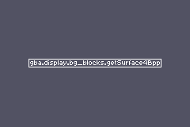

# Backgrounds and tile maps

A normal background draws a tile map. Tile pixels live in a character block; map entries live in a screen block; each entry chooses a tile and, for 4bpp graphics, a palette bank. Treat those as separate resources even when an image conversion tool generated all of them together.

The common setup sequence is: copy palette data, copy tiles, write or copy the map, configure `bg_ctrl`, enable the background in `display.ctrl`, then update `bg_scroll` in the frame loop. Here is the essential setup from the [tile demo](https://github.com/braheezy/ziggba/blob/master/examples/tileDemo/tileDemo.zig):

```zig
const gba = @import("gba");
const brin = @import("brin.zig");

const screenblock_index: u5 = 31;

fn loadData() void {
    const screenblock = &gba.display.screenblocks[screenblock_index];
    gba.display.memcpyBackgroundPalette(0, @ptrCast(&brin.pal));
    gba.display.memcpyBackgroundTiles4Bpp(0, @ptrCast(&brin.tiles));
    gba.mem.memcpy16(screenblock, &brin.map, brin.map.len);
}

pub export fn main() void {
    loadData();
    gba.display.bg_ctrl[0] = .{
        .base_screenblock = screenblock_index,
        .size = .normal_64x32,
    };
    gba.display.ctrl.* = .{ .bg0 = true };
}
```

`brin` is the tile, palette, and map data imported by that example. `screenblock_index` must not overlap the character-block memory occupied by the tiles.



Scroll a configured background by assigning its pixel offset once per frame:

```zig
var scroll_x: i10 = 0;

while (true) {
    gba.display.naiveVSync();
    scroll_x +%= 1;
    gba.display.bg_scroll[0] = .init(scroll_x, 0);
}
```

Use 4bpp tiles when each tile fits in one 16-color bank. Use 8bpp tiles when a background needs one shared 256-color palette and the extra VRAM is acceptable. The asset workflow can generate both forms; [Image assets](assets.md) explains where its outputs go.
