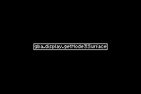
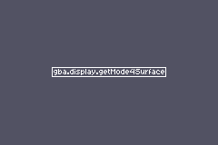

# Choose a display mode

Pick the representation that matches the game, not the one with the shortest first example.

| Mode | Best use | Main cost |
| --- | --- | --- |
| 3 | Direct-color drawing and prototypes | A full 16-bit framebuffer consumes VRAM and leaves no tile layers |
| 4 | Indexed full-screen art or software rendering | You manage a palette and pixels are palette indices |
| 0 | Tile backgrounds, text, and sprites | You prepare tiles, maps, palette banks, and object attributes |

Mode 3 stores `ColorRgb555` pixels directly. Mode 4 stores one-byte palette indices and supports two framebuffers, which makes page flipping possible. Mode 0 uses character blocks for tiles and screen blocks for maps; its objects share the sprite hardware.

## Mode 3: direct color

Mode 3 is the shortest path from code to a pixel. Its surface accepts `ColorRgb555` values directly:

```zig
gba.display.ctrl.* = .initMode3(.{});
const screen = gba.display.getMode3Surface();
screen.setPixel(120, 80, .red);
```



## Mode 4: indexed color

Mode 4 draws palette indices instead of colors. Load the palette first, then write indices to the selected page:

```zig
const palette = [_]gba.ColorRgb555{ .black, .red, .green };

gba.display.memcpyBackgroundPalette(0, &palette);
gba.display.ctrl.* = .initMode4(.{});
const screen = gba.display.getMode4Surface(0);
screen.setPixel(120, 80, 1); // Palette entry 1: red.
```



The [surfaces demo](https://github.com/braheezy/ziggba/blob/master/examples/surfaces/surfaces.zig) switches among tile, Mode 3, Mode 4, and Mode 5 surfaces.

Start a scrolling or sprite-based game in Mode 0. Start a paint-style prototype in Mode 3. Move to Mode 4 when you need a full-screen indexed surface or a flip-friendly software renderer. The [display API](/reference/gba/) names the exact control fields and surface functions.
