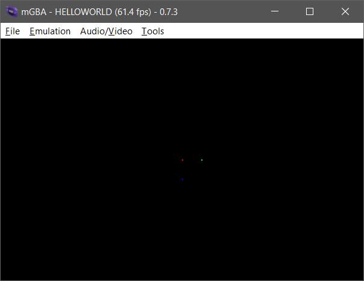

# ZigGBA documentation

ZigGBA is a small SDK for writing Game Boy Advance games in Zig. It gives you direct access to the hardware, plus practical helpers for display work, input, text, and assets.

Use the Zig version listed in the [repository README](https://github.com/braheezy/ziggba#usage) and a GBA emulator such as mGBA. From the root of an existing Zig project, add ZigGBA as a dependency:

```sh
zig fetch --save git+https://github.com/braheezy/ZigGBA.git
```

Set up `build.zig` with a ROM target. The build helper configures the GBA target and produces the `.gba` file:

```zig
const std = @import("std");
const ziggba = @import("ziggba");

pub fn build(b: *std.Build) void {
    const gba_b = ziggba.GbaBuild.create(b);
    _ = gba_b.addExecutable(.{
        .name = "first",
        .root_source_file = b.path("src/main.zig"),
    });
}
```

Put this in `src/main.zig`:

```zig
const gba = @import("gba");

export var header linksection(".gbaheader") = gba.Header.init("FIRST", "AFSE", "00", 0);

pub export fn main() void {
    gba.display.ctrl.* = .initMode3(.{});
    const mode3 = gba.display.getMode3Surface();
    mode3.setPixel(120, 80, .rgb(31, 0, 0));
    mode3.setPixel(136, 80, .rgb(0, 31, 0));
    mode3.setPixel(120, 96, .rgb(0, 0, 31));
}
```

Build the ROM with `zig build`, then open `zig-out/first.gba` in the emulator.



For the next step, choose a [graphics path](graphics/index.md) or add [input and timing](game-systems/index.md).

## API reference

- [Runtime API reference](/reference/gba/)
- [Build API reference](/reference/build/)
